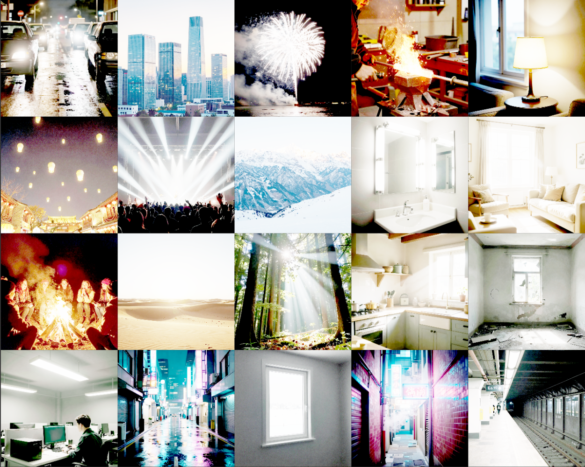
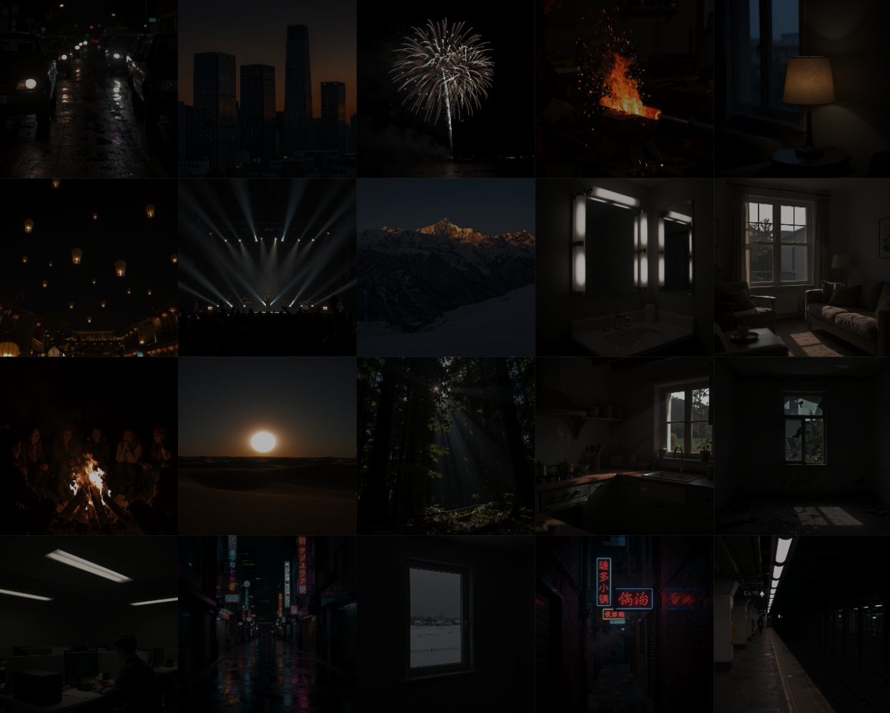

# LumiPic

**Single-Image HDR Reconstruction via LogC3-Encoded Diffusion Transformer LoRA**

Convert any standard dynamic range (SDR) image into a true high dynamic range (HDR) EXR file — float-valued, with range well beyond what an 8-bit SDR output can carry, using a lightweight LoRA adapter on a frozen diffusion transformer.

Based on the [LumiVid](https://hdr-lumivid.github.io/) research ([paper](https://arxiv.org/abs/2604.11788)), which introduced LogC3-encoded diffusion for HDR generation in the LTX-2 video model. **LumiPic** is the same technique adapted to single-image diffusion transformers — *the technique is base-model agnostic*. Two trained LoRA families are currently published, on different bases:

| Base model | Status | LoRA size | Inference speed | Notes |
|---|---|---|---|---|
| **Qwen-Image-Edit-2511** | mature (5+ iterations) | 563 MB | 1× | best quality, ~20B base, ~54 GB to download |
| **FLUX.2-klein-base-4B** | **alpha** (1 iteration) | 88 MB | ~2× faster | Apache 2.0, ~8 GB base, fastest end-to-end |
| **FLUX.2-klein-base-9B** | **alpha** (1 iteration) | 158 MB | ~1× | gated, more capacity than 4B, more nuanced HDR |

The Qwen-Image-Edit path is the production default. The two klein paths are early experiments — same dataset, same hyperparameters — that ran fast enough to be worth shipping but haven't been iterated on. See "Quickstart" below to pick one.

## How It Works

1. **Input**: Any SDR image (JPEG, PNG, etc.)
2. **Process**: A LoRA-adapted Diffusion Transformer (DiT) generates output in [ARRI LogC3](https://www.arri.com/en/learn-help/learn-help-camera-system/technical-information/about-log-c) space
3. **Output**: Scene-linear HDR EXR file with values up to ~55x brighter than white

The key insight: HDR values are compressed into LogC3 [0, 1] range before VAE encoding. The VAE stays frozen — it treats LogC3 data as a normal image. The LoRA teaches the DiT to produce LogC3-encoded output. At inference, the VAE output is decompressed back to linear HDR.

This technique can be applied to **any** Diffusion Transformer architecture. This release uses [Qwen-Image-Edit-2511](https://huggingface.co/Qwen/Qwen-Image-Edit-2511) as the base model.

## Setup

### 1. Install dependencies

```bash
pip install torch torchvision --index-url https://download.pytorch.org/whl/cu124
pip install diffusers transformers accelerate safetensors peft
pip install Pillow opencv-python numpy
```

Or use the requirements file:
```bash
pip install -r requirements.txt
```

### 2. Pick a base + LoRA

All weights are on [oumoumad/LumiPic](https://huggingface.co/oumoumad/LumiPic) and download automatically on first run.

**Qwen-Image-Edit-2511 path** (mature, recommended for production):
- `v5b_step2000.safetensors` — **Qwen default**. Most robust; best on stylized/AI-generated SDR inputs.
- `v9_step1500.safetensors` — alternative. LumiVid-aligned augs; slightly better on natural photo content.
- `hdrdit_v1_QE2511.safetensors` — original v1 release.

```bash
python inference.py --image photo.jpg                                   # uses v5b by default
python inference.py --image photo.jpg --weight-name v9_step1500.safetensors
```

**FLUX.2-klein-base-4B path** (alpha, fastest):
- `klein4b_alpha_step1750.safetensors` — **klein-4B default**. Faithful HDR look, well-balanced.
- `klein4b_alpha_step1000.safetensors` — alternative. More aggressive HDR (higher p99) but tends to blow out highlights on bright scenes.

```bash
python inference_klein.py --image photo.jpg                                          # uses 1750 by default
python inference_klein.py --image photo.jpg --weight-name klein4b_alpha_step1000.safetensors
```

**FLUX.2-klein-base-9B path** (alpha, more capacity):
- `klein9b_alpha_step2000.safetensors` — only published klein-9B checkpoint. More nuanced output than klein-4B (less raw range, but better-behaved across scene types — see "Comparison").

The base model is **gated** on HuggingFace — request access at https://huggingface.co/black-forest-labs/FLUX.2-klein-base-9B before first run.

```bash
python inference_klein.py --image photo.jpg --base black-forest-labs/FLUX.2-klein-base-9B \
    --weight-name klein9b_alpha_step2000.safetensors
```

### 3. Base model

Whichever LoRA you pick, the base model downloads automatically on first run via `diffusers`:

| LoRA family | Base model | Download size |
|---|---|---|
| `v5b_*`, `v9_*`, `hdrdit_v1_*` | [Qwen/Qwen-Image-Edit-2511](https://huggingface.co/Qwen/Qwen-Image-Edit-2511) | ~54 GB |
| `klein4b_*` | [black-forest-labs/FLUX.2-klein-base-4B](https://huggingface.co/black-forest-labs/FLUX.2-klein-base-4B) | ~8 GB |
| `klein9b_*` | [black-forest-labs/FLUX.2-klein-base-9B](https://huggingface.co/black-forest-labs/FLUX.2-klein-base-9B) (gated) | ~17 GB |

```bash
export HF_HOME=/path/to/cache  # optional, controls where bases cache
```

## Usage

```bash
# Single image → EXR
python inference.py --image photo.jpg

# Specify output path
python inference.py --image photo.jpg --output photo_hdr.exr

# Batch: directory of images
python inference.py --image-dir ./inputs --output-dir ./outputs

# Custom inference settings
python inference.py --image photo.jpg --steps 40 --guidance 3.0 --seed 42

# Skip preview PNG generation
python inference.py --image photo.jpg --no-preview
```

### Python API

**Qwen-Image-Edit-2511 path** (production):
```python
from inference import load_pipeline, convert_to_hdr, save_exr
from logc3 import LogC3
from PIL import Image

pipe = load_pipeline()           # uses oumoumad/LumiPic + v5b_step2000.safetensors by default
logc3 = LogC3()
image = Image.open("photo.jpg").convert("RGB")

hdr = convert_to_hdr(pipe, image, logc3, steps=40, guidance=3.0, seed=42)  # [H, W, 3] linear
save_exr(hdr, "photo_hdr.exr")
print(f"max: {hdr.max():.1f}, p99: {float(__import__('numpy').percentile(hdr,99)):.2f}")
```

**FLUX.2-klein-base-4B path** (alpha):
```python
from inference_klein import load_pipeline, convert_to_hdr, save_exr
from logc3 import LogC3
from PIL import Image

# Klein needs `pip install "git+https://github.com/huggingface/diffusers.git"` (>=0.37.0.dev0)
pipe = load_pipeline()           # uses oumoumad/LumiPic + klein4b_alpha_step1750.safetensors
logc3 = LogC3()
image = Image.open("photo.jpg").convert("RGB")

hdr = convert_to_hdr(pipe, image, logc3, steps=25, guidance=3.0, seed=42)
save_exr(hdr, "photo_hdr.exr")
```

### Prompt

The model expects the prompt `"Convert this image to HDR"`. This is hardcoded in `inference.py`. Changing the prompt is not recommended as the LoRA was trained specifically with this prompt.

## ComfyUI

Two ready-to-use workflows are included, one for each base:

| Workflow | Base + LoRA | Folder |
|---|---|---|
| [`comfyui/SDR_To_HDR_QE11.json`](comfyui/SDR_To_HDR_QE11.json) | Qwen-Image-Edit-2511 + `v5b_step2000.safetensors` | `ComfyUI/models/loras/qwen/hdr/` |
| [`comfyui/SDR_To_HDR_klein4b.json`](comfyui/SDR_To_HDR_klein4b.json) | FLUX.2-klein-base-4B + `klein4b_alpha_step1750.safetensors` | `ComfyUI/models/loras/flux/hdr/` |
| [`comfyui/SDR_To_HDR_klein9b.json`](comfyui/SDR_To_HDR_klein9b.json) | FLUX.2-klein-base-9B + `klein9b_alpha_step2000.safetensors` | `ComfyUI/models/loras/flux/hdr/` |

Both also live on the [HuggingFace repo](https://huggingface.co/oumoumad/LumiPic). They both use the `Gear · LogC3 Decode + Save EXR` node from [ComfyUI_Gear](https://github.com/oumad/ComfyUI_Gear) for the LogC3 decode + float16 EXR write.

To use either:
1. Drop the `.json` onto your ComfyUI canvas
2. Place the matching LoRA file in the folder shown above
3. Install [ComfyUI_Gear](https://github.com/oumad/ComfyUI_Gear) custom nodes
4. Queue with prompt `"Convert this image to HDR"`

## Hardware Requirements

| GPU VRAM | Config | Notes |
|----------|--------|-------|
| **48GB+** | Unquantized bf16 | Recommended (best quality) |
| **32GB** | 8-bit quantization | Good quality, some precision loss |
| **24GB** | 4-bit quantization | Usable, noticeable quality tradeoff |

The base model requires ~54 GB disk space for initial download.

## Output Format

- **Format**: OpenEXR, half-float (16-bit), ZIP compression
- **Color space**: Scene-linear RGB, Rec.709/sRGB primaries
- **Value range**: 0 to ~55.1 (LogC3 EI 800 ceiling)
- **Recommended display transform**: ACES Output Transform (sRGB/Rec.709 100 nits)
- **Compatible with**: Nuke, Blender, DaVinci Resolve, After Effects, Houdini

## Examples

Same 20 HDR outputs, viewed at two extreme exposure offsets. Detail survives in both the highlights (EV+6 shows blown-out SDR regions still carrying structure) and the shadows (EV-6 shows dim regions still holding information) — that's the dynamic range the LoRA is reconstructing.

**Exposure +6 (highlights pulled down):**



**Exposure -6 (shadows pushed up):**



## Technical Details

### LogC3 Encoding

[ARRI LogC3](https://www.arri.com/en/learn-help/learn-help-camera-system/technical-information/about-log-c) (Exposure Index 800) is the standard log encoding used by ARRI cinema cameras. It maps scene-linear values to a perceptually uniform [0, 1] range:

- **Mid-gray** (0.18 linear) → 0.39 LogC3
- **10 stops above mid-gray** (~55.1 linear) → 1.0 LogC3
- **Shadow detail** (0.001 linear) → 0.09 LogC3

This encoding preserves highlight detail far better than simple gamma or PQ curves, and is widely used in the VFX industry.

### Architecture

```
SDR Image (8-bit PNG/JPEG)
    ↓
DiT base model (frozen VAE + LoRA-adapted transformer)
    ↓  prompt: "Convert this image to HDR"
VAE output: LogC3-encoded [0, 1]
    ↓
LogC3 decompress → scene-linear HDR [0, ~55.1]
    ↓
Save as OpenEXR (half-float, ZIP)
```

- **VAE**: Frozen — treats LogC3 as a normal image (validated: shadow MSE ~5e-5 on FLUX.2 VAE)
- **DiT**: LoRA rank 32 on the transformer
  - Qwen-Image-Edit-2511: 840 modules, 563 MB per LoRA
  - FLUX.2-klein-base-4B: 80 modules, 88 MB per LoRA
- **Inference**: 25–40 steps, guidance scale 3.0, flowmatch scheduler

The technique is base-model agnostic — any DiT with a "normal-image" VAE can host a LumiPic LoRA.

### Training

Trained with [Ostris AI-Toolkit](https://github.com/ostris/ai-toolkit). Common to both bases:

| Parameter | Value |
|-----------|-------|
| Dataset | ~260–606 HDR pairs (varies by version) |
| Sources | Poly Haven HDRIs, RED/ARRI camera footage, CG renders, Blender scenes |
| SDR augmentation | Exposure ±1.5 stops, luminance blur, contrast, JPEG Q20-55, WB jitter |
| LoRA rank | 32, alpha 32 |
| Steps | 2000 |
| Batch size | 4 (1 × grad_accum 4 for klein) |
| Precision | bf16 |
| Optimizer | AdamW, lr 1e-4 |
| Scheduler | Flowmatch (weighted timesteps) |
| Key config | `cache_latents_to_disk: true` |

**Qwen-Image-Edit-2511 LoRAs** are trained with the [npy-float32-targets fork](https://github.com/oumad/ai-toolkit/tree/npy-float32-targets) of ai-toolkit (float32 `.npy` targets for shadow precision). The current release `v5b_step2000.safetensors` is from the 5th iteration of the dataset/augmentation pipeline; `hdrdit_v1_QE2511.safetensors` is kept for reproducibility.

**FLUX.2-klein-base-4B LoRAs** are trained with upstream ai-toolkit (8-bit PNG targets). The published `klein4b_alpha_*` weights come from a single 2000-step run on V8 data — no iteration yet, hence "alpha". Note: training the klein image-edit path requires a 4-line VAE-on-GPU patch to `flux2_model.py` (see [training notes](https://github.com/oumad/LumiPic/issues) — bundle on request). Klein converges fast: peak HDR range at ~step 1000, sweet spot around 1500–1750.

### Why LogC3 over other encodings?

| Encoding | Max linear | Stops above mid-gray | Industry use |
|----------|-----------|---------------------|-------------|
| **LogC3 (ours)** | 55.1 | ~14 | ARRI cameras, VFX |
| PU21 (X2HDR) | 10,000 | ~26 | Perceptual research |
| PQ/ST.2084 | 10,000 | ~26 | HDR displays |
| sRGB gamma | 1.0 | 0 | Consumer displays |

LogC3 provides sufficient range for most real-world content while staying within a compact [0, 1] range that existing VAEs handle well.

## File Structure

```
LumiPic/
├── inference.py        # Qwen-Image-Edit-2511 inference (production)
├── inference_klein.py  # FLUX.2-klein-base-4B inference (alpha)
├── logc3.py            # ARRI LogC3 transfer function (compress/decompress)
├── requirements.txt    # Python dependencies
├── LICENSE             # MIT
├── comfyui/            # ComfyUI workflow JSONs (one per base)
└── assets/examples/    # Example images for README
```

## Citation

If you use LumiPic, please also cite LumiVid, the paper that introduced the LogC3 diffusion technique this project builds on:

```bibtex
@misc{lumipic2026,
  title={LumiPic: Single-Image HDR Reconstruction via LogC3-Encoded Diffusion Transformer LoRA},
  author={Oumoumad},
  year={2026},
  url={https://github.com/oumad/LumiPic}
}

@article{korem2026lumivid,
  title={LumiVid: HDR Video Generation via LogC3-Encoded Diffusion},
  author={Korem, Naomi Ken and others},
  journal={arXiv preprint arXiv:2604.11788},
  year={2026},
  url={https://hdr-lumivid.github.io/}
}
```

## Acknowledgments

This work is inspired by **LumiVid** ([project page](https://hdr-lumivid.github.io/) · [paper](https://arxiv.org/abs/2604.11788)) — the Lightricks research that pioneered LogC3-encoded diffusion for HDR generation in the LTX-2 video model. LumiPic adapts the same core technique (LogC3 compression into the VAE's normalized input range, LoRA-adapted DiT predicting log-encoded HDR) to a single-image editing DiT.

- [LumiVid](https://hdr-lumivid.github.io/) — [paper](https://arxiv.org/abs/2604.11788) — Lightricks' HDR video generation research that introduced the LogC3 diffusion approach
- [Naomi Ken Korem](https://github.com/Naomi-Ken-Korem) ([HuggingFace](https://huggingface.co/naomiKenKorem)) — first author on LumiVid; her research at Lightricks is the foundation this project builds upon
- [Ostris AI-Toolkit](https://github.com/ostris/ai-toolkit) — training framework
- [Qwen-Image-Edit](https://huggingface.co/Qwen/Qwen-Image-Edit-2511) — base model
- [Poly Haven](https://polyhaven.com/) — CC0 HDR environment maps
- [ARRI](https://www.arri.com/) — LogC3 transfer function specification

## License

MIT
