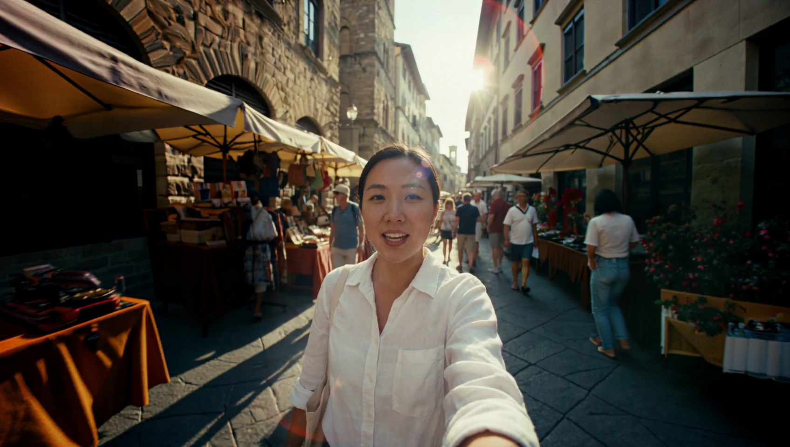
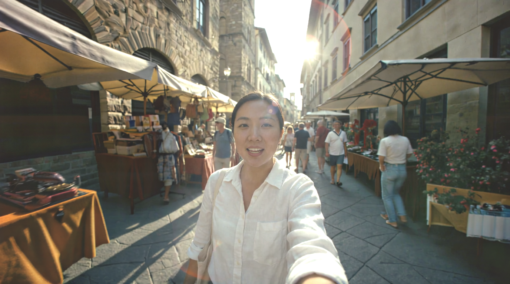
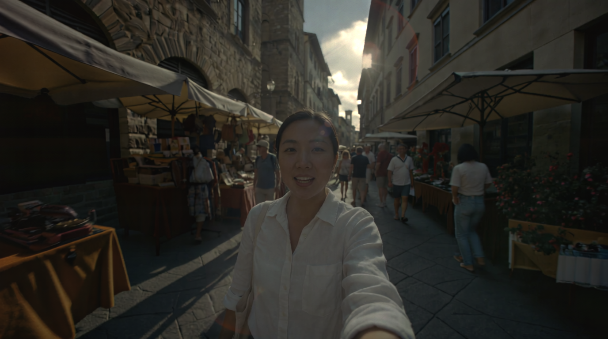
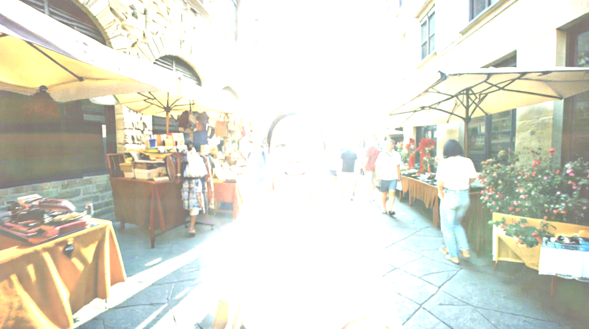

# LumiPic

**Single-Image HDR Reconstruction via LogC3-Encoded Diffusion Transformer LoRA**

Convert any standard dynamic range (SDR) image into a true high dynamic range (HDR) EXR file with 10+ stops of dynamic range — using a lightweight LoRA adapter on a frozen diffusion transformer.

Based on the [LumiVid](https://hdr-lumivid.github.io/) research ([paper](https://arxiv.org/abs/2604.11788)), which introduced LogC3-encoded diffusion for HDR generation in the LTX-2 video model. LumiPic adapts that technique to a single-image editing DiT (Qwen-Image-Edit-2511).

## How It Works

1. **Input**: Any SDR image (JPEG, PNG, etc.)
2. **Process**: A LoRA-adapted Diffusion Transformer (DiT) generates output in [ARRI LogC3](https://www.arri.com/en/learn-help/learn-help-camera-system/technical-information/about-log-c) space
3. **Output**: Scene-linear HDR EXR file with values up to ~55x brighter than white

The key insight: HDR values are compressed into LogC3 [0, 1] range before VAE encoding. The VAE stays frozen — it treats LogC3 data as a normal image. The LoRA teaches the DiT to produce LogC3-encoded output. At inference, the VAE output is decompressed back to linear HDR.

This technique can be applied to **any** Diffusion Transformer architecture. This release uses [Qwen-Image-Edit-2511](https://huggingface.co/Qwen/Qwen-Image-Edit-2511) as the base model.

## Setup

### 1. Install dependencies

```bash
pip install torch torchvision --index-url https://download.pytorch.org/whl/cu124
pip install diffusers transformers accelerate safetensors peft
pip install Pillow opencv-python numpy
```

Or use the requirements file:
```bash
pip install -r requirements.txt
```

### 2. Download the LoRA weights

The weights are hosted on HuggingFace and downloaded automatically on first run:

- **HuggingFace**: [oumoumad/LumiPic](https://huggingface.co/oumoumad/LumiPic)
  - `v5b_step2000.safetensors` (563 MB) — **default**. Most robust overall; best on stylized/AI-generated SDR inputs.
  - `v9_step1500.safetensors` (563 MB) — alternative. Trained with LumiVid-aligned augs (joint HDR+SDR EV shifts, luminance blur p=1.0). Slightly better on natural photo content (wins 7/10 scenes on our benchmark); worse on AI-generated inputs.
  - `hdrdit_v1_QE2511.safetensors` (563 MB) — original v1 release.
- **GitHub Release**: [v1.0](https://github.com/oumad/LumiPic/releases/tag/v1.0) (alternative download)

To use a specific checkpoint from the HF repo:
```bash
python inference.py --image photo.jpg --weight-name v5b_step2000.safetensors
```

Or use a local `.safetensors` file:
```bash
python inference.py --image photo.jpg --lora ./path/to/v5b_step2000.safetensors
```

### 3. Base model

The base model [Qwen/Qwen-Image-Edit-2511](https://huggingface.co/Qwen/Qwen-Image-Edit-2511) (~54 GB) is downloaded automatically by `diffusers` on first run. Set `HF_HOME` to control where it's cached:

```bash
export HF_HOME=/path/to/cache  # optional
```

## Usage

```bash
# Single image → EXR
python inference.py --image photo.jpg

# Specify output path
python inference.py --image photo.jpg --output photo_hdr.exr

# Batch: directory of images
python inference.py --image-dir ./inputs --output-dir ./outputs

# Custom inference settings
python inference.py --image photo.jpg --steps 40 --guidance 3.0 --seed 42

# Skip preview PNG generation
python inference.py --image photo.jpg --no-preview
```

### Python API

```python
from inference import load_pipeline, convert_to_hdr, save_exr, LogC3

pipe = load_pipeline(
    model_id="Qwen/Qwen-Image-Edit-2511",  # base model
    lora_id="oumoumad/LumiPic",              # LoRA (HuggingFace ID or local path)
)
logc3 = LogC3()

from PIL import Image
image = Image.open("photo.jpg").convert("RGB")

# Returns numpy array [H, W, 3] in scene-linear HDR
hdr = convert_to_hdr(pipe, image, logc3, steps=40, guidance=3.0, seed=42)

# Save as EXR
save_exr(hdr, "photo_hdr.exr")

# Access raw values
print(f"Max: {hdr.max():.1f}, Mean: {hdr.mean():.3f}")
print(f"Pixels > 1.0: {(hdr > 1.0).mean() * 100:.1f}%")
```

### Prompt

The model expects the prompt `"Convert this image to HDR"`. This is hardcoded in `inference.py`. Changing the prompt is not recommended as the LoRA was trained specifically with this prompt.

## Hardware Requirements

| GPU VRAM | Config | Notes |
|----------|--------|-------|
| **48GB+** | Unquantized bf16 | Recommended (best quality) |
| **32GB** | 8-bit quantization | Good quality, some precision loss |
| **24GB** | 4-bit quantization | Usable, noticeable quality tradeoff |

The base model requires ~54 GB disk space for initial download.

## Output Format

- **Format**: OpenEXR, half-float (16-bit), ZIP compression
- **Color space**: Scene-linear RGB, Rec.709/sRGB primaries
- **Value range**: 0 to ~55.1 (LogC3 EI 800 ceiling)
- **Recommended display transform**: ACES Output Transform (sRGB/Rec.709 100 nits)
- **Compatible with**: Nuke, Blender, DaVinci Resolve, After Effects, Houdini

## Examples

| Input (SDR) | Output (HDR, ACES tonemapped) | EV -3 | EV +3 |
|:-----------:|:-----------------------------------:|:-----:|:-----:|
|  |  |  |  |
|  |  |  |  |

## Technical Details

### LogC3 Encoding

[ARRI LogC3](https://www.arri.com/en/learn-help/learn-help-camera-system/technical-information/about-log-c) (Exposure Index 800) is the standard log encoding used by ARRI cinema cameras. It maps scene-linear values to a perceptually uniform [0, 1] range:

- **Mid-gray** (0.18 linear) → 0.39 LogC3
- **10 stops above mid-gray** (~55.1 linear) → 1.0 LogC3
- **Shadow detail** (0.001 linear) → 0.09 LogC3

This encoding preserves highlight detail far better than simple gamma or PQ curves, and is widely used in the VFX industry.

### Architecture

```
SDR Image (8-bit PNG/JPEG)
    ↓
Qwen-Image-Edit-2511 (frozen VAE + LoRA-adapted DiT)
    ↓  prompt: "Convert this image to HDR"
VAE output: LogC3-encoded [0, 1]
    ↓
LogC3 decompress → scene-linear HDR [0, ~55.1]
    ↓
Save as OpenEXR (half-float, ZIP)
```

- **VAE**: Frozen — treats LogC3 as a normal image
- **DiT**: LoRA rank 32 (840 modules, 563 MB)
- **Inference**: 40 steps, guidance scale 3.0, flowmatch scheduler

### Training

Trained using [Ostris AI-Toolkit](https://github.com/oumad/ai-toolkit/tree/npy-float32-targets) (fork with float32 .npy target support):

| Parameter | Value |
|-----------|-------|
| Base model | Qwen-Image-Edit-2511 |
| Dataset | ~260 diverse HDR pairs |
| Sources | Poly Haven HDRIs, RED/ARRI camera footage, CG renders, Blender scenes |
| Target format | Float32 LogC3-compressed .npy |
| SDR augmentation | Exposure ±1.5 stops, luminance blur, contrast, JPEG Q20-55, WB jitter |
| LoRA rank | 32, alpha 32 |
| Steps | 2000 |
| Batch size | 4 |
| Precision | bf16 |
| Optimizer | AdamW, lr 1e-4 |
| Scheduler | Flowmatch (weighted timesteps) |
| Key config | `cache_latents_to_disk: true` |

The current release checkpoint (`v5b_step2000.safetensors`) comes from the 5th iteration of the dataset/augmentation pipeline; `hdrdit_v1_QE2511.safetensors` is kept available for reproducibility of the initial release.

### Why LogC3 over other encodings?

| Encoding | Max linear | Stops above mid-gray | Industry use |
|----------|-----------|---------------------|-------------|
| **LogC3 (ours)** | 55.1 | ~14 | ARRI cameras, VFX |
| PU21 (X2HDR) | 10,000 | ~26 | Perceptual research |
| PQ/ST.2084 | 10,000 | ~26 | HDR displays |
| sRGB gamma | 1.0 | 0 | Consumer displays |

LogC3 provides sufficient range for most real-world content while staying within a compact [0, 1] range that existing VAEs handle well.

## File Structure

```
LumiPic/
├── inference.py       # Complete inference pipeline
├── logc3.py           # ARRI LogC3 transfer function (compress/decompress)
├── requirements.txt   # Python dependencies
├── LICENSE            # MIT
└── assets/examples/   # Example images for README
```

## Citation

If you use LumiPic, please also cite LumiVid, the paper that introduced the LogC3 diffusion technique this project builds on:

```bibtex
@misc{lumipic2026,
  title={LumiPic: Single-Image HDR Reconstruction via LogC3-Encoded Diffusion Transformer LoRA},
  author={Oumoumad},
  year={2026},
  url={https://github.com/oumad/LumiPic}
}

@article{korem2026lumivid,
  title={LumiVid: HDR Video Generation via LogC3-Encoded Diffusion},
  author={Korem, Naomi Ken and others},
  journal={arXiv preprint arXiv:2604.11788},
  year={2026},
  url={https://hdr-lumivid.github.io/}
}
```

## Acknowledgments

This work is inspired by **LumiVid** ([project page](https://hdr-lumivid.github.io/) · [paper](https://arxiv.org/abs/2604.11788)) — the Lightricks research that pioneered LogC3-encoded diffusion for HDR generation in the LTX-2 video model. LumiPic adapts the same core technique (LogC3 compression into the VAE's normalized input range, LoRA-adapted DiT predicting log-encoded HDR) to a single-image editing DiT.

- [LumiVid](https://hdr-lumivid.github.io/) — [paper](https://arxiv.org/abs/2604.11788) — Lightricks' HDR video generation research that introduced the LogC3 diffusion approach
- [Naomi Ken Korem](https://github.com/Naomi-Ken-Korem) ([HuggingFace](https://huggingface.co/naomiKenKorem)) — first author on LumiVid; her research at Lightricks is the foundation this project builds upon
- [Ostris AI-Toolkit](https://github.com/ostris/ai-toolkit) — training framework
- [Qwen-Image-Edit](https://huggingface.co/Qwen/Qwen-Image-Edit-2511) — base model
- [Poly Haven](https://polyhaven.com/) — CC0 HDR environment maps
- [ARRI](https://www.arri.com/) — LogC3 transfer function specification

## License

MIT
